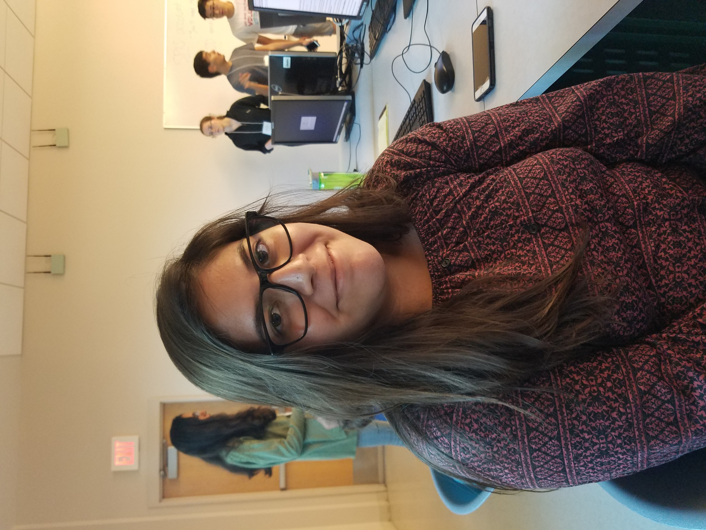

# practice-juliana-a

Hi! I'm Juli and I'm from the San Fernando Valley in Los Angeles. I'm hoping to learn the essentaial foundations of comupter science that will allow me to succeed once the fall quarter begins. I also hope to make a lot of cool SPIS friends. In my free time, I especially love writing and playing music. I sing and play four instruments: the piano, the guitar, the ukulele, and the violin. I'm self-taught in all of these expect the violin. I hope to pick up more instruments soon :))

